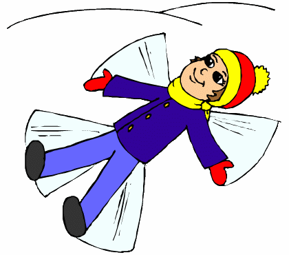
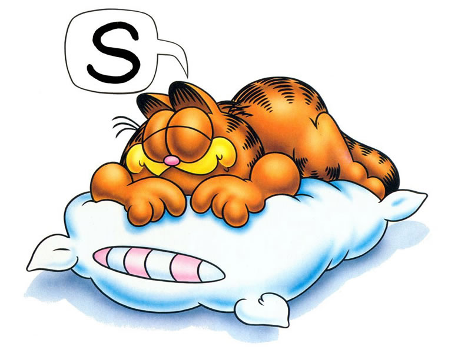

.. template:: bwp_template

:componey: Blue White Porcelain Software Ltd.

.. page-type:: cover

*rstslide* Feature Demonstration
================================

.. new-page::

Paragraph
=========

Using \**Bold\** to **Bold** text, \*italic\* for *italic*. \``Inline source
code\`` for ``Inline source code``.

Paragraph is separated by blank line. And this is very very very very very very
very very very very very very long line for wrap testing.

    Block quoted paragraph.

Another Paragraph

.. new-page::

Bullet list
===========

* Item 1
* Item 2
* Item 3. very long very long very long very long very long very long very long
  very long very long very long very long very long very long very long very
  long very long very long very long very long very long 

  * Sub Item

    * SubSub Item

      * SubSubSub Item
* Item 4

.. new-page::

Ordered list (style I)
======================

1. Item 1
#. Item 2

Custom start no.

4. Item 4
#. Item 5

a. Item a
#. Item b
   
   I. Sub Item 1
   #. Sub Item 1

      i. Sub Sub Item

A. Upper alpha
#. Item B

.. new-page::

Ordered list (style II)
=======================

1) Item 1
#) Item 2

Custom start no.

4) Item 4
#) Item 5

a) Item a
#) Item b
   
   I) Sub Item 1
   #) Sub Item 1

      i) Sub Sub Item

A) Upper alpha
#) Item B

.. new-page::

Ordered list (style III)
========================

(1) Item 1
(#) Item 2

Custom start no.

(4) Item 4
(#) Item 5

(a) Item a
(#) Item b
   
    (I) Sub Item 1
    (#) Sub Item 1

        (i) Sub Sub Item

(A) Upper alpha
(#) Item B

.. new-page::

Image: Align
=================

.. new-page::
Image: Width/Height
===================

.. new-page::

Image: Scale
===================

.. new-page::
Image: .png/.gif/.jpg
=====================

.. output-to:: left

snow-angel.gif

.. output-to:: right

sleep.jpg

.. new-page::

Pause
=====

Using **.. pause::** to hold output of current page,

.. pause::

and continue on the next page.

.. new-page::

Named output position
=====================
.. output-to:: left

* Item 1
* Item 2
* Iitem 3
* abcd 1234abcd 1234abcd 1234abcd 1234abcd 1234abcd 1234abcd 1234abcd 1234abcd
  1234abcd 1234abcd 1234abcd 1234abcd 1234abcd 1234abcd 1234abcd 1234abcd
  1234abcd 1234abcd 1234abcd 1234

.. output-to:: right

* Item 4
* Item 5
* Item 6
* abcd 1234abcd 1234abcd 1234abcd 1234abcd 1234abcd 1234abcd 1234abcd 1234abcd
  1234abcd 1234abcd 1234abcd 1234abcd 1234abcd 1234abcd 1234abcd 1234abcd
  1234abcd 1234abcd 1234abcd 1234
